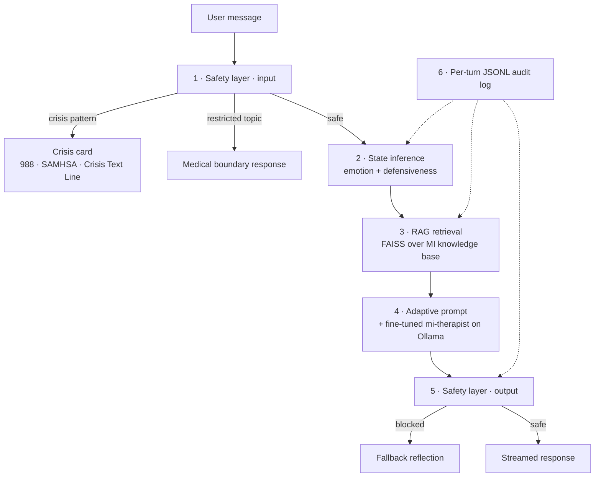

# Motivational Interviewing Chatbot

A conversational companion that practices Motivational Interviewing (MI) for alcohol-related conversations. The goal isn't to advise or diagnose — it's to listen, reflect, and support autonomy the way a trained counselor would.

<p align="center">
  
  
  
</p>

## TL;DR

This is my MS capstone. The core is a **fine-tuned Gemma 2** model (`mi-therapist`) trained on the [AnnoMI dataset](https://github.com/uccollab/AnnoMI) plus ~1,000 synthetic MI conversations I generated with Claude. It runs locally via Ollama; if Ollama is unreachable, the app falls back to Claude Haiku via the Anthropic API. Two interfaces share one Python pipeline: a **Streamlit** app for development/evaluation, and a **React + FastAPI** end-user web app.

## Contents

1. [Quick start](#quick-start)
2. [Architecture](#architecture)
3. [How the pipeline works (step by step)](#how-the-pipeline-works-step-by-step)
4. [Two interfaces, one pipeline](#two-interfaces-one-pipeline)
5. [Tech stack](#tech-stack)
6. [Project layout](#project-layout)
7. [The AI engineering work](#the-ai-engineering-work)
8. [Honest limits](#honest-limits)
9. [Crisis resources](#crisis-resources)

---

## Quick start

You need **Python 3.10+** and **[Ollama](https://ollama.com/)**. Model weights aren't in the repo (1.6 GB, gitignored) — train your own via [`notebooks/finetune_gemma2.ipynb`](notebooks/finetune_gemma2.ipynb), or skip Ollama and let the app fall back to Claude Haiku.

**Step 1 — install dependencies**

```bash
python -m venv venv
source venv/bin/activate          # Windows: .\venv\Scripts\activate
pip install -r requirements.txt
```

**Step 2 — (optional) register the fine-tuned model with Ollama**

```bash
ollama create mi-therapist -f models/Modelfile
```

**Step 3 — pick an interface**

```bash
# End-user web app (FastAPI + React, single port)
uvicorn backend_server:app --host 127.0.0.1 --port 8000

# Developer / evaluation app (Streamlit, exposes model picker + state debug)
streamlit run app.py
```

Open <http://127.0.0.1:8000> for the web app, or whatever port Streamlit prints.

> **No Ollama? No problem.** Put `ANTHROPIC_API_KEY=...` in `.env` and either app will detect Ollama is down and fall back to Claude Haiku automatically.

---

## Architecture

Every user message goes through six pipeline stages before the model generates a reply:



Every turn writes a structured JSONL record to `logs/<session_id>.jsonl` capturing the inferred state, safety level, and retrieved knowledge — so the pipeline is auditable after the fact, not a black-box LLM call.

---

## How the pipeline works (step by step)

### Step 1 — Input safety check
[`src/safety_layer.py`](src/safety_layer.py) runs the user message through regex patterns for crisis indicators (suicidal ideation, self-harm, overdose) and restricted topics (medication dosing, prescriptions). A crisis match short-circuits the entire pipeline — no model call, no RAG, just the crisis-resource response. A restricted-topic match returns a medical boundary response.

### Step 2 — State inference
[`src/state_inference.py`](src/state_inference.py) scores the message on two axes:

- **Emotion**: neutral / frustrated / anxious / sad / angry / hopeful / contemplative
- **Defensiveness**: none / low / moderate / high

For local Gemma runs the inference is rule-based for speed (~30 ms). For API runs it's a quick LLM call. Either way the result steers the response style downstream — and gets logged but **never surfaced to the end user**.

### Step 3 — Retrieval (RAG)
[`src/rag_pipeline.py`](src/rag_pipeline.py) maintains a FAISS index over `knowledge_base/` using `all-MiniLM-L6-v2` embeddings. Top-3 chunks are retrieved per turn, biased by the inferred state — e.g., a "highly defensive" turn surfaces resistance-handling chunks instead of empathy reflections.

### Step 4 — Response generation
[`src/response_generator.py`](src/response_generator.py) builds the final prompt: system message (MI principles + style guidelines) + retrieved knowledge + recent context window + the new user turn. Sent to the fine-tuned `mi-therapist` on Ollama, with Claude Haiku as a transparent fallback if Ollama is unreachable.

### Step 5 — Output safety check
The generated response is screened for medical-advice patterns ("you should take", "I recommend stopping", dosage references). If matched, the response is replaced with a generic reflective fallback. This catches cases where the model strays despite system-prompt guardrails.

### Step 6 — Logging
The `ConversationLogger` in [`src/safety_layer.py`](src/safety_layer.py) writes one JSONL entry per turn under `logs/<session_id>.jsonl` containing: timestamp, user message, bot response, inferred state (emotion + defensiveness + reasoning + linguistic markers), safety level, retrieved chunks. Crisis-flagged turns are also appended to `logs/flagged_for_review.jsonl` for after-the-fact review.

---

## Two interfaces, one pipeline

The same `ConversationManager` powers both — only the presentation layer differs.

| | End-user web app | Developer / eval app |
|---|---|---|
| **Entry point** | [`backend_server.py`](backend_server.py) + [`capstone-chatbot-design/`](capstone-chatbot-design/) | [`app.py`](app.py) |
| **Stack** | FastAPI + React (Babel in-browser, no build step) | Streamlit |
| **Surfaces internal state?** | No — clean conversation only | Yes — model picker, detected emotion, doc retrieval count, JSON debug panel |
| **Crisis handling** | Soft inline card with 988 / SAMHSA / Crisis Text Line | Long-form text response |
| **Why it exists** | Demoable to non-technical users (capstone presentation, prof review) | Debugging without the state inspector is painful |

---

## Tech stack

**ML & data**
Python · PyTorch · Hugging Face Transformers (LoRA via PEFT) · sentence-transformers · FAISS · LangChain · pandas

**Inference & deployment**
Ollama (local Gemma 2 fine-tune as GGUF Q4_K_M) · Anthropic API (Claude Haiku fallback) · OpenAI API (optional)

**Web**
FastAPI · uvicorn · Pydantic · React 18 (UMD via CDN) · Babel Standalone (in-browser JSX compile) · Streamlit

**Observability**
loguru · per-turn JSONL audit logs · Claude-as-judge eval framework

---

## Project layout

```
src/                           # Runtime pipeline (shared by both UIs)
  conversation_manager.py      # Orchestrator
  state_inference.py           # Emotion + defensiveness detection
  rag_pipeline.py              # FAISS-based retrieval
  response_generator.py        # Adaptive prompt construction
  safety_layer.py              # Crisis / restricted-topic guards
  config.py

backend_server.py              # FastAPI server for the end-user web app
app.py                         # Streamlit dev/evaluation app

capstone-chatbot-design/       # End-user web frontend
  Aside.html                   # Entry point
  src/
    app.jsx                    # Composition root
    chat-pieces.jsx            # Header, MessageList, MessageInput, CrisisCard, …
    modals.jsx                 # CrisisModal, AboutModal, MenuDrawer
    mock-backend.jsx           # API client (talks to /api/chat)
    icons.jsx

scripts/                       # Data + eval pipelines (offline, not runtime)
  prepare_annomi.py
  generate_synthetic_data.py
  prepare_finetune_data.py
  score_with_claude.py
  run_eval_test20.py

notebooks/                     # Fine-tuning + inference (Colab/Kaggle)
knowledge_base/                # MI guidelines + AnnoMI examples
data/                          # Processed datasets, synthetic batches, eval results
docs/                          # Project artifacts (briefings, screenshots)
models/                        # (gitignored) GGUF weights + Ollama Modelfile
logs/                          # (gitignored) per-session JSONL audit logs
```

---

## The AI engineering work

This is the part worth a capstone grade.

### Fine-tuning
- **Base**: `google/gemma-2-2b-it`
- **Method**: LoRA (PEFT), trained on Colab T4
- **Training data**: AnnoMI alcohol-only subset (~676 KB JSONL) + ~1,000 synthetic MI conversations
- **Output**: 4-bit quantized GGUF for Ollama ([`notebooks/export_model_for_ollama.ipynb`](notebooks/export_model_for_ollama.ipynb))

### Synthetic data generation
Real MI transcripts are rare and expensive. [`scripts/generate_synthetic_data.py`](scripts/generate_synthetic_data.py) prompts Claude to simulate both sides of a session across scenario types (short / medium / long / mixed defensiveness). Generated batches live in [`data/synthetic/`](data/synthetic/).

### Evaluation
Built a Claude-as-judge evaluation rather than relying on human scoring — too slow for iteration.

- **Scenarios**: 20 handcrafted user turns covering different emotion × defensiveness combinations ([`data/evaluation/eval_scenarios_test20.jsonl`](data/evaluation/eval_scenarios_test20.jsonl))
- **Judge**: Claude Sonnet scores each response across MI dimensions (empathy, autonomy support, change talk, style match, safety)
- **Configs compared**: base Gemma, fine-tuned v1, v2, v2 + RAG, Claude Haiku baseline
- **Scripts**: [`scripts/score_with_claude.py`](scripts/score_with_claude.py), [`scripts/run_eval_test20.py`](scripts/run_eval_test20.py)

### RAG
FAISS index over the MI knowledge base using `all-MiniLM-L6-v2` embeddings, top-3 retrieval. Retrieved chunks get injected into the prompt as context-specific guidance — e.g., if the user is scored as highly defensive, the retriever surfaces resistance-handling strategies from the MI playbook.

### Why Motivational Interviewing?
MI is a counseling approach built around four principles: express empathy, roll with resistance, support autonomy, develop discrepancy. It's the opposite of confrontation — you don't tell someone they have a problem, you help them notice it themselves. That turns out to be a useful fit for an LLM, because models are bad at confrontation but reasonable at reflective listening.

Alcohol dialogues specifically are a stress test: users come in ambivalent or defensive, so "be empathetic" isn't enough — the bot has to recognize the defensiveness and respond to it differently.

---

## Honest limits

- **Not clinically validated.** This is a capstone, not a product.
- **Emotion classifier** gets subtle affects wrong (resignation often reads as "sad").
- **LLM-as-judge eval** correlates with human MI ratings but not perfectly. Treated as a coarse iteration signal, not ground truth.
- **Latency** is ~2–4 s per turn on CPU Ollama. Fine for demos, too slow for real conversation.
- **No memory** across sessions.
- **Crisis detection is regex-based** — semantically equivalent phrasings will be missed if not pre-listed. Recently broadened with optional-intensifier patterns (`don't even want to be here`, `no reason to keep going`, etc.) but not exhaustive.

---

## Crisis resources

If you or someone you know needs help:

- **988** — US Suicide & Crisis Lifeline
- **SAMHSA**: 1-800-662-4357
- **Crisis Text Line**: text **HOME** to **741741**

---

## License

Academic / capstone use only.
