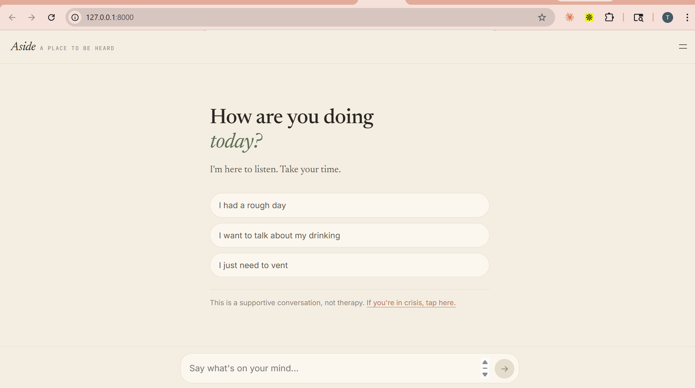
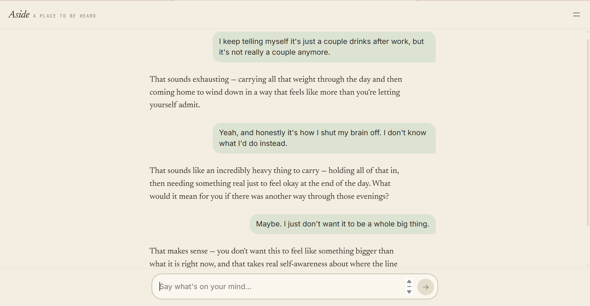
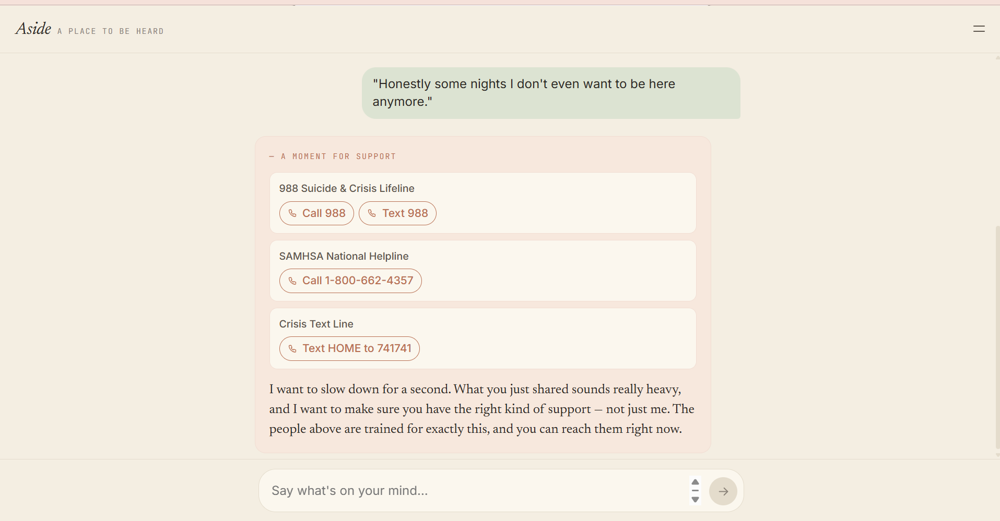
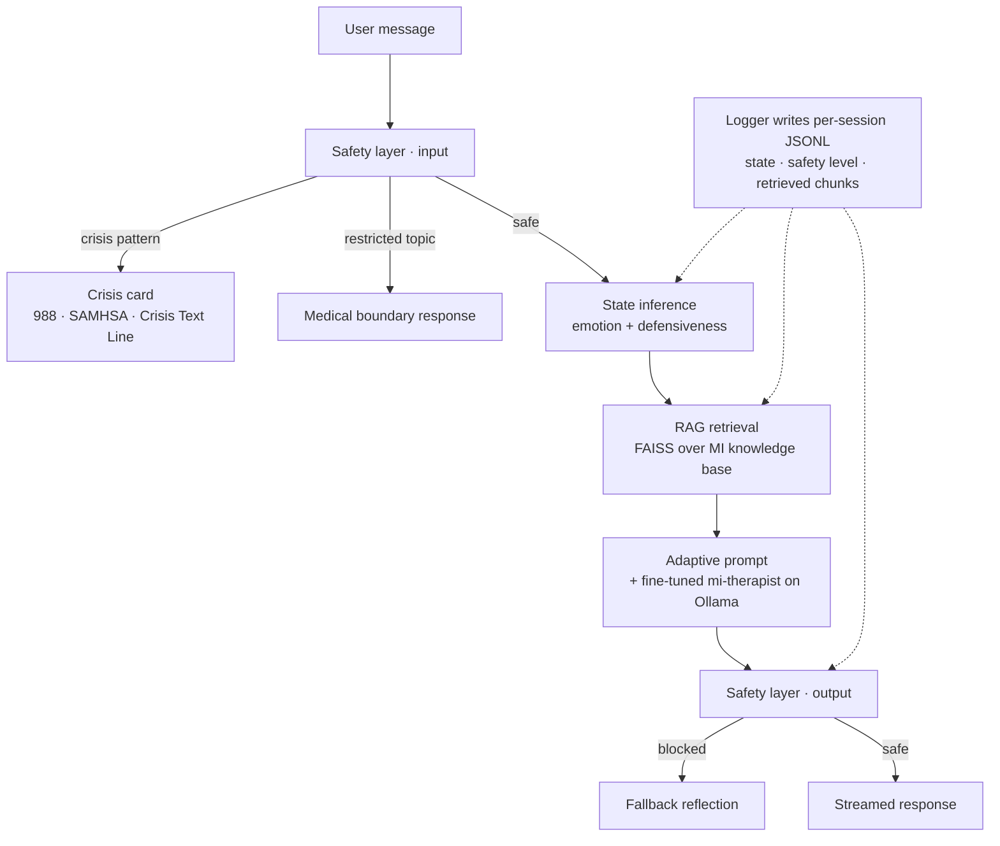

# Motivational Interviewing Chatbot

A conversational companion that practices Motivational Interviewing (MI) for alcohol-related conversations. The goal isn't to advise or diagnose — it's to listen, reflect, and support autonomy the way a trained counselor would.

This is my MS capstone project. The core of it is a **fine-tuned Gemma 2 model** (`mi-therapist`) trained on the [AnnoMI dataset](https://github.com/uccollab/AnnoMI) plus ~1,000 synthetic conversations I generated with Claude. It runs locally via Ollama; if Ollama is unreachable, the app falls back to Claude Haiku through the Anthropic API.

There are two interfaces on top of the same pipeline: a **Streamlit** dev/evaluation app that exposes internal state for debugging, and a clean end-user web app — **React** frontend (JSX compiled in-browser by Babel Standalone, CSS custom properties for theming) wired to a **FastAPI + uvicorn** backend.

## End-user web interface

<p align="center">
  
  
  
</p>

The end-user UI hides everything that isn't the conversation — no model picker, no debug panels, no detected-emotion labels surfaced to the user. The same state inference, RAG retrieval, and safety pipeline still runs underneath, it's just no longer part of what the user sees.

When the safety layer flags a turn as crisis, the assistant message renders as a distinct soft card with 988 / SAMHSA / Crisis Text Line surfaced inline above the response — see the third screenshot.

## What it does

A user types a message. Before generating a reply, the system:

1. **Infers user state** — the emotion (neutral, frustrated, anxious, sad, angry, hopeful, contemplative) and defensiveness level (none / low / moderate / high). Used to steer the response style.
2. **Retrieves relevant guidelines** from a FAISS index over a curated MI knowledge base (OARS, stage-of-change, resistance handling, anti-patterns, real AnnoMI excerpts).
3. **Runs a safety check** — any message matching crisis patterns (suicidal ideation, self-harm, overdose) short-circuits to crisis resources. Restricted topics like medication dosing are blocked too.
4. **Generates a response** with prompts adapted to the inferred state and retrieved knowledge.

### Pipeline



Every turn writes a structured JSONL record to `logs/<session_id>.jsonl` capturing the inferred state, safety level, and retrieved knowledge — so the pipeline is auditable after the fact, not just a black-box LLM call.

## Running it

You need Python 3.10+ and [Ollama](https://ollama.com/). The fine-tuned model weights aren't in the repo (1.6 GB, gitignored) — you'll either have to train your own via [`notebooks/finetune_gemma2.ipynb`](notebooks/finetune_gemma2.ipynb) or skip Ollama and use the Claude fallback.

```bash
python -m venv venv
source venv/bin/activate        # Windows: .\venv\Scripts\activate
pip install -r requirements.txt

# If you have the GGUF file locally, register it with Ollama:
ollama create mi-therapist -f models/Modelfile
```

Then pick the interface:

**End-user web app (FastAPI + the Claude Design frontend):**

```bash
uvicorn backend_server:app --host 127.0.0.1 --port 8000
```

Open <http://127.0.0.1:8000>. Single server — the API and the static frontend are served on the same origin.

**Developer / evaluation app (Streamlit, exposes model picker, detected emotion, debug panel):**

```bash
streamlit run app.py
```

Don't want to mess with Ollama? Put `ANTHROPIC_API_KEY=...` in a `.env` file and either app will detect Ollama is down and fall back to Claude Haiku automatically.

## Why Motivational Interviewing?

MI is a counseling approach built around four principles: express empathy, roll with resistance, support autonomy, and develop discrepancy. It's the opposite of confrontation — you don't tell someone they have a problem, you help them notice it themselves. That turns out to be a useful fit for an LLM chatbot, because models are bad at confrontation but reasonable at reflective listening.

Alcohol dialogues specifically are a stress test: users come in ambivalent or defensive, so "be empathetic" isn't enough — the bot has to recognize the defensiveness and respond to it differently.

## The AI engineering work

This is the part worth a capstone grade.

### Fine-tuning
- **Base**: `google/gemma-2-2b-it`
- **Method**: LoRA (PEFT), trained on Colab T4
- **Training data**: AnnoMI alcohol-only subset (~676 KB JSONL) + ~1,000 synthetic MI conversations
- Exported as 4-bit quantized GGUF for Ollama ([`notebooks/export_model_for_ollama.ipynb`](notebooks/export_model_for_ollama.ipynb))

### Synthetic data generation
Real MI transcripts are rare and expensive. [`scripts/generate_synthetic_data.py`](scripts/generate_synthetic_data.py) prompts Claude to simulate both sides of a session across scenario types (short / medium / long / mixed defensiveness). Generated batches live in [`data/synthetic/`](data/synthetic/).

### Evaluation
Built a Claude-as-judge evaluation rather than relying on human scoring — too slow for iteration.

- **Scenarios**: 20 handcrafted user turns covering different emotion × defensiveness combinations ([`data/evaluation/eval_scenarios_test20.jsonl`](data/evaluation/eval_scenarios_test20.jsonl))
- **Judge**: Claude Sonnet scores each response across MI dimensions (empathy, autonomy support, change talk, style match, safety)
- **Configs compared**: base Gemma, fine-tuned v1, v2, v2 + RAG, Claude Haiku baseline
- Scripts: [`scripts/score_with_claude.py`](scripts/score_with_claude.py), [`scripts/run_eval_test20.py`](scripts/run_eval_test20.py)

### RAG
FAISS index over the MI knowledge base using `all-MiniLM-L6-v2` embeddings, top-3 retrieval. Retrieved chunks get injected into the prompt as context-specific guidance — e.g., if the user is scored as highly defensive, the retriever surfaces resistance-handling strategies from the MI playbook.

### End-user web stack
- **Frontend**: React 18 with JSX compiled in-browser by Babel Standalone — no build step, pure SPA. CSS custom properties drive the warm sage/cream palette; typography uses Newsreader serif (assistant text), Inter (UI), JetBrains Mono (eyebrow labels) via Google Fonts.
- **Backend**: FastAPI + uvicorn in [`backend_server.py`](backend_server.py). A single server serves both the static frontend and the `/api/chat` endpoint that wraps the conversation pipeline — so the React app and the Python pipeline run on the same origin (no CORS, single port).
- The Streamlit dev/evaluation app ([`app.py`](app.py)) is untouched and remains the engineering-facing interface, with model picker and per-turn state inspector visible.

## Project layout

```
src/                           # Runtime pipeline (shared by both UIs)
  conversation_manager.py      # Orchestrator
  state_inference.py           # Emotion + defensiveness detection
  rag_pipeline.py              # FAISS-based retrieval
  response_generator.py        # Adaptive prompt construction
  safety_layer.py              # Crisis / restricted-topic guards
  config.py

backend_server.py              # FastAPI server for the end-user web app
app.py                         # Streamlit dev/evaluation app

capstone-chatbot-design/       # End-user web frontend (Claude Design export)
  Aside.html                   # entry point
  src/
    app.jsx                    # composition root
    chat-pieces.jsx            # Header, MessageList, MessageInput, CrisisCard, …
    modals.jsx                 # CrisisModal, AboutModal, MenuDrawer
    mock-backend.jsx           # API client (talks to /api/chat)
    icons.jsx

scripts/                       # Data + eval pipelines (offline, not runtime)
  prepare_annomi.py
  generate_synthetic_data.py
  prepare_finetune_data.py
  score_with_claude.py
  run_eval_test20.py

notebooks/                     # Fine-tuning + inference (Colab/Kaggle)
knowledge_base/                # MI guidelines + AnnoMI examples
data/                          # Processed datasets, synthetic batches, eval results
docs/                          # Project artifacts (briefings, screenshots)
models/                        # (gitignored) GGUF weights + Ollama Modelfile
logs/                          # (gitignored) per-session JSONL audit logs
```

## Honest limits

- Not clinically validated. This is a capstone, not a product.
- The emotion classifier is LLM-based and gets subtle affects wrong (resignation often reads as "sad").
- Claude-as-judge scoring correlates roughly but not perfectly with human MI ratings. I treat it as a coarse signal for iteration, not ground truth.
- Latency is ~2–4 s per turn on CPU Ollama; fine for demos, too slow for a real conversation.
- No memory across sessions.

## Crisis resources

If you or someone you know needs help:
- **988** — US Suicide & Crisis Lifeline
- **SAMHSA**: 1-800-662-4357
- **Crisis Text Line**: text HOME to 741741

## License

Academic / capstone use only.
